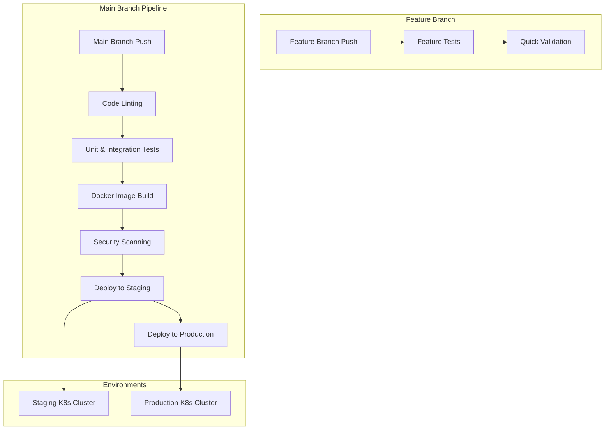
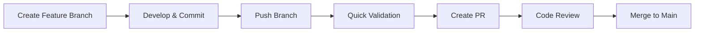
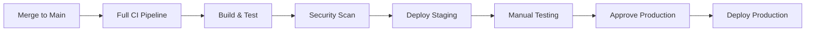

# 🚀 CI/CD Pipeline Guide

## 📋 Overview

The HFT Crypto Bot uses a comprehensive **Continuous Integration and Continuous Deployment (CI/CD)** pipeline powered by **GitHub Actions**. The pipeline ensures code quality, runs comprehensive tests, builds Docker images, performs security scans, and automatically deploys to staging and production environments.

## 🏗️ Pipeline Architecture



## 🔄 Workflow Triggers

### **Feature Branch Workflow** (`.github/workflows/feature-test.yml`)
**Triggers**: Push to any branch except `main` and `develop`
- ✅ **Quick validation only**
- 🏃‍♂️ **Fast feedback** (< 5 minutes)
- 🧪 **Basic tests** and linting
- 💬 **PR comments** with validation results

### **Main CI/CD Workflow** (`.github/workflows/ci-cd.yml`)
**Triggers**: 
- Push to `main` or `develop` branches
- Manual workflow dispatch
- Pull requests to `main`

## 📊 Pipeline Stages

### **1. Code Quality & Linting**
```yaml
jobs:
  lint:
    name: Code Quality & Linting
    runs-on: ubuntu-latest
```

**Tools Used**:
- **Black**: Code formatting (`black --check --diff`)
- **isort**: Import sorting (`isort --check-only --diff`)
- **flake8**: Linting (`flake8 --max-line-length=100`)
- **mypy**: Type checking (`mypy --ignore-missing-imports`)
- **bandit**: Security scanning (`bandit -r services/ common/`)
- **safety**: Dependency vulnerability check (`safety check`)

**Artifacts Generated**:
- `bandit-report.json`: Security scan results
- `safety-report.json`: Dependency vulnerability report

### **2. Unit & Integration Tests**
```yaml
jobs:
  test:
    name: Unit & Integration Tests
    runs-on: ubuntu-latest
    needs: lint
```

**Features**:
- **Redis Service**: Automatically started for integration tests
- **Coverage Reporting**: 80% minimum coverage requirement
- **Multiple Test Types**: Unit, integration, async tests
- **JUnit Reports**: For GitHub integration

**Artifacts Generated**:
- `coverage.xml`: Coverage report in XML format
- `htmlcov/`: HTML coverage report
- `pytest-report.xml`: JUnit test results

**Environment**:
- Python 3.11
- Redis 7 (alpine)
- Test database: SQLite

### **3. Docker Image Building**
```yaml
jobs:
  build:
    name: Build Docker Images
    runs-on: ubuntu-latest
    needs: [lint, test]
```

**Strategy**: Matrix build for all services
- `ingestion`
- `kalman_filter`  
- `garch_model`
- `execution`
- `risk_manager`
- `orchestrator`

**Features**:
- **Multi-platform builds**: `linux/amd64`, `linux/arm64`
- **Registry**: Docker Hub (`docker.io`)
- **Caching**: GitHub Actions cache for faster builds
- **SBOM Generation**: Software Bill of Materials for security
- **Metadata Extraction**: Automated tagging strategy

**Image Tags**:
- `latest`: For main branch
- `{branch}-{sha}`: For feature branches  
- `{sha}`: Git commit hash
- `pr-{number}`: For pull requests

### **4. Security Scanning**
```yaml
jobs:
  security-scan:
    name: Security Scanning
    runs-on: ubuntu-latest
    needs: build
```

**Tools Used**:
- **Trivy**: Container vulnerability scanning
- **SARIF Upload**: GitHub Security tab integration
- **Multi-service scanning**: All Docker images scanned

**Integration**:
- Results uploaded to GitHub Security tab
- SARIF format for detailed vulnerability reports
- Automatic issue creation for critical vulnerabilities

### **5. Staging Deployment**
```yaml
jobs:
  deploy-staging:
    name: Deploy to Staging
    runs-on: ubuntu-latest
    needs: [build, build-monitoring]
```

**Features**:
- **Kubernetes Deployment**: Staging cluster deployment
- **Health Checks**: Automated service health verification
- **Smoke Tests**: Basic functionality testing
- **Rollout Status**: Wait for successful deployment
- **Slack Notifications**: Success/failure alerts

**Environment**:
- **Name**: `staging`
- **URL**: `https://hft-staging.yourdomain.com`
- **Namespace**: `hft-staging`
- **Configuration**: Debug mode, reduced resources

### **6. Production Deployment**
```yaml
jobs:
  deploy-production:
    name: Deploy to Production
    runs-on: ubuntu-latest
    needs: [deploy-staging, security-scan]
```

**Features**:
- **Manual Trigger Only**: `workflow_dispatch` required
- **Backup Creation**: Automatic deployment backup
- **Rolling Updates**: Zero-downtime deployment
- **Comprehensive Health Checks**: All services validated
- **Production Monitoring**: Full observability stack

**Environment**:
- **Name**: `production`
- **URL**: `https://hft-prod.yourdomain.com`
- **Namespace**: `hft-production`
- **Configuration**: Production settings, full resources

## 🔧 Configuration

### **Required GitHub Secrets**

#### **Docker Registry**
```bash
DOCKER_USERNAME          # Docker Hub username
DOCKER_PASSWORD          # Docker Hub password/token
```

#### **Kubernetes Clusters**
```bash
KUBE_CONFIG_STAGING      # Base64 encoded kubeconfig for staging
KUBE_CONFIG_PRODUCTION   # Base64 encoded kubeconfig for production
```

#### **Notifications**
```bash
SLACK_WEBHOOK            # Slack webhook URL for notifications
```

### **Environment Variables**
```yaml
env:
  REGISTRY: docker.io
  IMAGE_PREFIX: hft-crypto-bot
  PYTHON_VERSION: '3.11'
  NODE_VERSION: '18'
```

### **Repository Settings**

#### **Branch Protection Rules**
- **Require status checks**: All CI jobs must pass
- **Require branches to be up to date**: Enforce latest changes
- **Require pull request reviews**: At least 1 reviewer
- **Dismiss stale reviews**: When new commits are pushed
- **Restrict pushes**: Only admins can push to `main`

#### **Environment Protection**
- **Staging**: Automatic deployment on `main` push
- **Production**: Manual approval required
- **Required reviewers**: Production deployments need approval

## 📦 Kubernetes Deployment

### **Staging Configuration**
```yaml
# Resource limits (per service)
resources:
  requests:
    memory: "256Mi"
    cpu: "250m"
  limits:
    memory: "512Mi" 
    cpu: "500m"

# Configuration
ENVIRONMENT: "staging"
LOG_LEVEL: "DEBUG"
BINANCE_TESTNET: "true"
EVOP_MAX_CHALLENGERS: "2"
CHAMPION_INITIAL_CAPITAL: "10000.0"
```

### **Production Configuration**
```yaml
# Resource limits (per service)
resources:
  requests:
    memory: "512Mi"
    cpu: "500m"
  limits:
    memory: "2Gi"
    cpu: "2000m"

# Configuration  
ENVIRONMENT: "production"
LOG_LEVEL: "INFO"
BINANCE_TESTNET: "false"
EVOP_MAX_CHALLENGERS: "5"
CHAMPION_INITIAL_CAPITAL: "500000.0"
```

### **Service Mesh Architecture**
```yaml
# Core Services
- ingestion-service:8000     # Market data ingestion
- kalman-filter-service:8001 # Dynamic hedge ratios
- garch-model-service:8002   # Volatility forecasting
- execution-service:8003     # Trading execution
- risk-manager-service:8004  # Risk management & BOCD
- orchestrator-service:8005  # EVOP framework

# Infrastructure
- kafka:9092                 # Message broker
- redis:6379                 # Cache & service registry
- zookeeper:2181             # Kafka coordination

# Monitoring
- prometheus:9090            # Metrics collection
- grafana:3000              # Dashboards
- alertmanager:9093         # Alert management
```

## 🧪 Testing Strategy

### **Feature Branch Testing**
```bash
# Quick validation pipeline
- Code formatting check
- Import sorting verification  
- Basic linting
- Unit tests only (no integration)
- Docker build validation
- PR comment with results
```

### **Main Branch Testing**
```bash
# Comprehensive testing pipeline
- Full linting suite (black, isort, flake8, mypy, bandit, safety)
- Unit tests with coverage (80% minimum)
- Integration tests with Redis
- Async test support
- Performance tests
- Security vulnerability scanning
```

### **Test Environment**
```yaml
services:
  redis:
    image: redis:7-alpine
    ports: [6379:6379]
    health_cmd: "redis-cli ping"
    
environment:
  REDIS_URL: redis://localhost:6379
  DATABASE_URL: sqlite:///test.db
  LOG_LEVEL: DEBUG
```

## 🚨 Alerting & Notifications

### **Slack Integration**
```yaml
# Success notification
✅ HFT Crypto Bot successfully deployed to staging!
📊 Coverage: 85%
🕐 Duration: 12m 34s
🏷️ Version: main-a1b2c3d

# Failure notification  
❌ HFT Crypto Bot staging deployment failed!
🔍 Stage: Security Scanning
📋 Details: Critical vulnerability in base image
🔗 Logs: [View Details]
```

### **GitHub Integration**
- **Status Checks**: Required for merge
- **Security Alerts**: Automatic issue creation
- **PR Comments**: Automated validation results
- **Deployment Status**: Environment status tracking

### **Monitoring Integration**
```yaml
# Prometheus alerts triggered by deployment
- deployment_failure
- service_startup_time > 5m
- health_check_failure
- image_vulnerability_critical
```

## 📈 Metrics & Observability

### **Pipeline Metrics**
- **Build Duration**: Time for each pipeline stage
- **Success Rate**: Percentage of successful deployments
- **MTTR**: Mean time to recovery from failures
- **Test Coverage**: Code coverage percentage trends

### **Deployment Metrics**
- **Deployment Frequency**: How often deployments occur
- **Lead Time**: Time from commit to production
- **Change Failure Rate**: Percentage of deployments causing issues
- **Recovery Time**: Time to recover from failed deployments

### **Security Metrics**
- **Vulnerability Count**: Number of security issues found
- **SBOM Coverage**: Software bill of materials completeness
- **Dependency Updates**: Frequency of dependency updates
- **Security Scan Duration**: Time for security validation

## 🛠️ Local Development & Testing

### **Pre-commit Setup**
```bash
# Install pre-commit hooks
pip install pre-commit
pre-commit install

# Run all checks locally
pre-commit run --all-files
```

### **Local Pipeline Testing**
```bash
# Run linting locally
black --check services/ common/ tests/
isort --check-only services/ common/ tests/
flake8 services/ common/ tests/
mypy services/ common/

# Run tests locally
pytest tests/ -v --cov=services --cov=common

# Build Docker images locally
./scripts/docker-build.sh

# Deploy to local Kubernetes
./scripts/deploy-k8s.sh -e staging deploy
```

### **Pipeline Debugging**
```bash
# Check workflow syntax
gh workflow view ci-cd.yml

# Run workflow manually
gh workflow run ci-cd.yml --ref main

# Check workflow status
gh run list --workflow=ci-cd.yml

# View workflow logs
gh run view [run-id] --log
```

## 🔒 Security Best Practices

### **Secret Management**
- **GitHub Secrets**: All sensitive data stored securely
- **Kubernetes Secrets**: Base64 encoded in cluster
- **Registry Tokens**: Limited scope, regularly rotated
- **API Keys**: Testnet keys for staging, live keys for production

### **Image Security**
- **Multi-stage Builds**: Minimal production images
- **Non-root Users**: All containers run as non-root
- **Vulnerability Scanning**: Trivy integration
- **SBOM Generation**: Software bill of materials
- **Base Image Updates**: Automated dependency updates

### **Access Control**
- **Branch Protection**: Enforced review requirements
- **Environment Protection**: Production approval gates
- **Kubernetes RBAC**: Least privilege access
- **Network Policies**: Service mesh security

## 🚀 Deployment Workflow

### **Feature Development**


### **Production Release**


## 📋 Troubleshooting

### **Common Issues**

#### **Pipeline Failures**
```bash
# Check workflow status
gh run list --workflow=ci-cd.yml --limit=5

# View detailed logs
gh run view [run-id] --log

# Re-run failed jobs
gh run rerun [run-id]
```

#### **Docker Build Issues**
```bash
# Check Dockerfile syntax
docker build --dry-run -f services/execution/Dockerfile .

# Test build locally
./scripts/docker-build.sh execution

# Check registry connectivity
docker login docker.io
```

#### **Kubernetes Deployment Issues**
```bash
# Check cluster connectivity
kubectl cluster-info

# Validate manifests
kubectl apply --dry-run=client -f k8s/staging/

# Check deployment status
./scripts/deploy-k8s.sh status

# View pod logs
kubectl logs -f deployment/orchestrator-service -n hft-staging
```

#### **Test Failures**
```bash
# Run tests with verbose output
pytest tests/ -v -s --tb=long

# Run specific test
pytest tests/services/orchestrator/test_models.py::TestStrategyParameters -v

# Check test coverage
pytest tests/ --cov=services --cov-report=html
```

### **Performance Optimization**

#### **Build Speed**
- **Parallel Builds**: Matrix strategy for Docker images
- **Caching**: GitHub Actions cache for dependencies
- **Layer Optimization**: Multi-stage Dockerfile builds
- **Registry Caching**: Docker layer caching

#### **Test Speed**
- **Test Splitting**: Unit vs integration test separation
- **Parallel Execution**: pytest-xdist for parallel testing
- **Test Selection**: Smart test selection based on changes
- **Mock Services**: Mock external dependencies

## 📚 Additional Resources

- **GitHub Actions Documentation**: https://docs.github.com/en/actions
- **Kubernetes Deployment Guide**: [DOCKER_DEPLOYMENT_GUIDE.md](./DOCKER_DEPLOYMENT_GUIDE.md)
- **Security Scanning**: [Trivy Documentation](https://trivy.dev/)
- **Monitoring Setup**: [MONITORING_SETUP.md](./MONITORING_SETUP.md)

---

## 🆘 Support

### **Getting Help**
- **Pipeline Status**: Check GitHub Actions tab
- **Deployment Logs**: `./scripts/deploy-k8s.sh logs [service]`  
- **Health Checks**: `./scripts/health-check.sh`
- **Local Testing**: Run pipeline steps locally before pushing

### **Emergency Procedures**
- **Rollback**: `./scripts/deploy-k8s.sh rollback`
- **Emergency Stop**: Manual workflow cancellation
- **Hotfix Deployment**: Create hotfix branch and merge to main
- **Service Scaling**: `./scripts/deploy-k8s.sh scale [service] [replicas]`
