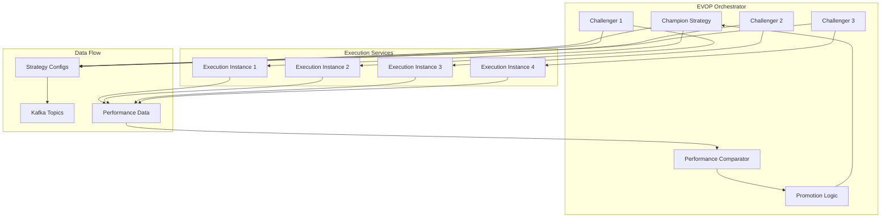

# 🧬 Evolutionary Operation (EVOP) Framework Guide

## 🎯 Overview

The **Evolutionary Operation (EVOP) Framework** is an advanced system for continuously optimizing trading strategy parameters through parallel execution and statistical performance comparison. It implements a champion-challenger paradigm where multiple strategy variations compete against the current best performer.

## 📊 Architecture



## 🔧 Core Components

### 1. **Champion-Challenger Manager**
- **File**: `services/orchestrator/champion_challenger.py`
- **Purpose**: Manages strategy lifecycle and parallel execution
- **Key Features**:
  - Champion strategy maintenance
  - Challenger generation with parameter mutations
  - Performance monitoring and comparison
  - Automatic strategy promotion

### 2. **Performance Comparator**
- **File**: `services/orchestrator/performance_comparator.py`
- **Purpose**: Statistical comparison of strategy performance
- **Key Features**:
  - Jobson-Korkie test for Sharpe ratio comparison
  - Welch's t-test for return comparison
  - F-test for volatility comparison
  - Multi-criteria aggregation with confidence scoring

### 3. **EVOP Data Models**
- **File**: `services/orchestrator/models.py`
- **Purpose**: Data structures for strategy management
- **Key Components**:
  - `StrategyInstance`: Complete strategy representation
  - `PerformanceMetrics`: Comprehensive performance tracking
  - `PromotionEvent`: Promotion history and audit trail
  - `EVOPConfiguration`: Framework configuration

### 4. **Orchestrator Service**
- **File**: `services/orchestrator/main.py`
- **Purpose**: Main service coordinating the EVOP framework
- **Key Features**:
  - Kafka integration for real-time communication
  - HTTP API for manual control and monitoring
  - Background evaluation loops
  - Emergency stop mechanisms

## 🚀 Key Features

### **Parallel Strategy Execution**
- Run 1 champion + N challengers simultaneously
- Independent capital allocation per strategy
- Isolated execution environments
- Real-time performance tracking

### **Parameter Mutation System**
```python
# Example parameter mutations
entry_z_score: 2.0 → 2.15 (±7.5% variation)
exit_z_score: 0.5 → 0.47 (±6% variation)  
kelly_fraction: 0.25 → 0.27 (±8% variation)
garch_window: 500 → 485 (±3% variation)
```

### **Statistical Performance Comparison**
- **Sharpe Ratio**: Jobson-Korkie test (p < 0.05)
- **Returns**: Welch's t-test with effect size
- **Drawdown**: Simple improvement threshold (>10%)
- **Calmar Ratio**: Relative improvement test
- **Stability**: F-test for variance comparison

### **Promotion Criteria**
- Minimum evaluation period (default: 7 days)
- Statistical significance (default: 95% confidence)
- Minimum performance improvement thresholds
- Multi-criteria aggregation with weights

### **Risk Management**
- Maximum total capital allocation (100%)
- Emergency stop on excessive drawdown (25%)
- Circuit breaker integration
- Position size limits per strategy

## 📋 Configuration

### **Environment Variables**

#### EVOP Framework Settings
```bash
EVOP_MAX_CHALLENGERS=3                    # Number of concurrent challengers
EVOP_CHALLENGER_CAPITAL_FRACTION=0.2      # Capital fraction per challenger (20%)
EVOP_MIN_EVALUATION_DAYS=7               # Minimum evaluation period
EVOP_CONFIDENCE_LEVEL=0.95               # Statistical confidence threshold
EVOP_EVALUATION_FREQUENCY=6              # Evaluation frequency (hours)
```

#### Parameter Mutation Settings
```bash
EVOP_MUTATION_RATE=0.1                   # Probability of mutating each parameter
EVOP_MUTATION_STD=0.05                   # Standard deviation for mutations (5%)
```

#### Champion Strategy Configuration
```bash
CHAMPION_INITIAL_CAPITAL=100000.0        # Starting capital allocation
CHAMPION_ENTRY_Z_SCORE=2.0               # Default entry threshold
CHAMPION_EXIT_Z_SCORE=0.5                # Default exit threshold
CHAMPION_KELLY_FRACTION=0.25             # Kelly criterion fraction
```

### **Docker Deployment**
```yaml
orchestrator-service:
  build:
    context: .
    dockerfile: services/orchestrator/Dockerfile
  ports:
    - "8005:8005"
  environment:
    - EVOP_MAX_CHALLENGERS=3
    - EVOP_CONFIDENCE_LEVEL=0.95
    # ... other settings
```

## 🔄 Workflow

### **1. Initialization**
1. Champion strategy created with base parameters
2. N challengers generated with mutated parameters
3. Capital allocated proportionally
4. All strategies started in parallel

### **2. Execution**
1. Each strategy executes independently
2. Performance metrics collected in real-time
3. Kafka topics used for coordination
4. Database logging for audit trail

### **3. Evaluation**
1. Periodic comparison (every 6 hours by default)
2. Statistical tests applied to performance data
3. Confidence scores calculated
4. Promotion decision made

### **4. Promotion**
1. Best challenger identified
2. Old champion stopped gracefully
3. Challenger promoted to champion
4. New challengers generated
5. Event logged for audit

### **5. Continuous Evolution**
```
Champion v1.0 → Challenger A wins → Champion v1.1 → Challenger B wins → Champion v1.2 → ...
```

## 📊 API Endpoints

### **Health & Status**
```bash
GET /health                              # Service health check
GET /status                              # Detailed EVOP status
GET /metrics                             # Prometheus metrics
```

### **Manual Control**
```bash
POST /promote/{challenger_id}            # Force challenger promotion
POST /emergency-stop                     # Emergency halt all strategies
```

### **Example Status Response**
```json
{
  "champion": {
    "id": "uuid-champion",
    "name": "Champion (promoted from Challenger-2)",
    "status": "running",
    "runtime_hours": 72.5,
    "performance": {
      "total_pnl": 15420.50,
      "sharpe_ratio": 1.85,
      "calmar_ratio": 1.42,
      "max_drawdown": 0.08,
      "total_trades": 156
    }
  },
  "challengers": [
    {
      "id": "uuid-challenger-1",
      "name": "Challenger-1",
      "status": "running",
      "runtime_hours": 24.2,
      "performance": { ... }
    }
  ],
  "active_strategies": 4,
  "promotion_count": 3,
  "last_evaluation": "2024-08-24T18:30:00Z"
}
```

## 📈 Performance Metrics

### **Strategy-Level Metrics**
- **Profitability**: Total P&L, realized/unrealized P&L, total return
- **Risk-Adjusted**: Sharpe ratio, Calmar ratio, Sortino ratio
- **Risk Metrics**: Maximum drawdown, current drawdown, volatility
- **Execution**: Average fill time, slippage, trade count, win rate

### **EVOP-Level Metrics**
- **Promotion Rate**: Frequency of successful promotions
- **Improvement Rate**: Performance improvement per promotion
- **Evaluation Efficiency**: Time between evaluations
- **Capital Utilization**: Allocation across strategies

### **System Metrics** (Prometheus)
```promql
# Strategy promotions
strategy_promotions_total{reason="superior_sharpe"}

# Performance improvements
strategy_performance_improvement{metric="sharpe_ratio"}

# Active strategies
evop_active_strategies_count

# Evaluation frequency
evop_evaluation_duration_seconds
```

## 🧪 Testing

### **Unit Tests**
```bash
# Test all EVOP components
pytest tests/services/orchestrator/ -v

# Test specific components
pytest tests/services/orchestrator/test_performance_comparator.py
pytest tests/services/orchestrator/test_champion_challenger.py
pytest tests/services/orchestrator/test_models.py
```

### **Integration Tests**
```bash
# Full system test with synthetic data
pytest tests/integration/test_evop_end_to_end.py

# Promotion logic test
pytest tests/integration/test_challenger_promotion.py
```

### **System Test Example**
```python
# Create synthetic data with known superior challenger
superior_params = StrategyParameters(entry_z_score=1.8)  # Better than 2.0
inferior_params = StrategyParameters(entry_z_score=2.5)  # Worse than 2.0

# Run simulation and verify promotion
assert challenger_promoted(superior_params)
assert not challenger_promoted(inferior_params)
```

## 🔧 Troubleshooting

### **Common Issues**

#### **No Promotions Occurring**
```bash
# Check evaluation logs
docker-compose logs orchestrator-service | grep "evaluation"

# Verify statistical significance
curl http://localhost:8005/status | jq '.challengers[].performance'

# Lower confidence threshold for testing
EVOP_CONFIDENCE_LEVEL=0.8
```

#### **Excessive Promotions**
```bash
# Increase confidence requirements
EVOP_CONFIDENCE_LEVEL=0.99
EVOP_MIN_SHARPE_IMPROVEMENT=0.2

# Extend evaluation period
EVOP_MIN_EVALUATION_DAYS=14
```

#### **Performance Comparison Failures**
```bash
# Check data quality
curl http://localhost:8005/status | jq '.champion.performance.daily_returns | length'

# Verify minimum sample size
EVOP_MIN_TRADES=50
```

### **Debug Mode**
```bash
# Enable detailed logging
LOG_LEVEL=DEBUG
ENABLE_DEBUG_LOGGING=true

# Check performance comparator details
docker-compose logs orchestrator-service | grep "comparison_result"
```

## 🚀 Production Deployment

### **Security Considerations**
- Change default API credentials
- Restrict network access to orchestrator
- Enable audit logging
- Implement proper authentication

### **Monitoring Setup**
- Grafana dashboard for EVOP metrics
- Alerts for promotion failures
- Performance degradation detection
- Capital allocation monitoring

### **Scaling Considerations**
- Horizontal scaling of execution services
- Load balancing for challenger strategies
- Database optimization for performance history
- Kafka partition management

## 🎯 Best Practices

### **Parameter Design**
1. **Start Conservative**: Use narrow mutation ranges initially
2. **Gradual Expansion**: Increase variation as system proves stable
3. **Domain Knowledge**: Respect logical parameter bounds
4. **Correlation Awareness**: Consider parameter interactions

### **Evaluation Strategy**
1. **Sufficient Data**: Ensure minimum sample sizes
2. **Statistical Rigor**: Use appropriate confidence levels
3. **Multiple Criteria**: Don't rely on single metrics
4. **Market Regime**: Adjust thresholds for different conditions

### **Risk Management**
1. **Capital Limits**: Never exceed total allocation
2. **Emergency Stops**: Implement multiple failsafes
3. **Position Sizing**: Use Kelly criterion or similar
4. **Diversification**: Avoid overly correlated challengers

### **Operational Excellence**
1. **Monitoring**: Comprehensive observability
2. **Testing**: Extensive unit and integration tests
3. **Documentation**: Keep runbooks updated
4. **Rollback**: Maintain ability to revert changes

---

## 📚 Related Documentation
- [Monitoring Setup Guide](./MONITORING_SETUP.md)
- [Docker Deployment Guide](./DOCKER_DEPLOYMENT_GUIDE.md)
- [API Reference](./docs/api/orchestrator.md)
- [Performance Metrics](./docs/metrics/evop.md)

## 🆘 Support
- **Health Check**: `curl http://localhost:8005/health`
- **Status Check**: `curl http://localhost:8005/status`
- **Logs**: `docker-compose logs orchestrator-service`
- **Metrics**: `curl http://localhost:8005/metrics`
