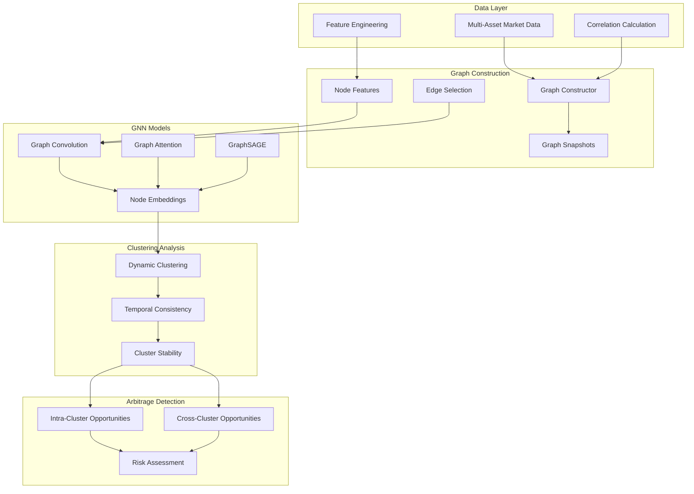

# 🧠 Graph Neural Networks for Crypto Cluster Detection - Research Guide

## 📋 Overview

This research project explores the use of **Graph Neural Networks (GNNs)** to model the entire crypto market as a dynamic graph and identify **dynamically co-moving clusters** of assets. The goal is to discover complex, multi-asset statistical arbitrage opportunities that go beyond simple pair trading strategies.

## 🎯 Research Objectives

### **Primary Goals**
1. **Dynamic Cluster Discovery**: Identify groups of cryptocurrencies that move together over time
2. **Multi-Asset Arbitrage**: Find statistical arbitrage opportunities within and across clusters
3. **Temporal Consistency**: Ensure cluster stability for reliable trading strategies
4. **Scalable Framework**: Build a research platform for continuous market analysis

### **Key Innovation**
- **Beyond Pairwise Analysis**: Traditional correlation-based approaches only consider pairs of assets
- **Dynamic Relationships**: Capture time-varying correlations and cluster membership
- **Graph-Based Representation**: Model the entire market as an interconnected network
- **Deep Learning Integration**: Use GNNs to learn complex, non-linear relationships

## 🏗️ Architecture Overview



## 🔬 Technical Implementation

### **1. Graph Construction Pipeline**

#### **Node Representation**
Each cryptocurrency is represented as a node with rich feature vectors:

```python
# Node features for each asset
node_features = [
    price_momentum_5d,      # 5-day price momentum
    price_momentum_24d,     # 24-day price momentum  
    volatility_5d,          # 5-day volatility
    volatility_24d,         # 24-day volatility
    volume_ratio,           # Current volume / average volume
    recent_return,          # Most recent return
    return_volatility,      # Return volatility
    skewness,              # Return distribution skewness
    kurtosis,              # Return distribution kurtosis
    rsi_momentum,          # RSI-like momentum indicator
    price_position          # Position in recent price range
]
```

#### **Edge Construction**
Edges represent relationships between assets based on:
- **Correlation Threshold**: Minimum correlation for edge creation
- **Dynamic Weighting**: Edge weights reflect correlation strength
- **Temporal Windows**: Rolling correlation calculations
- **Sparsity Control**: Maximum edges to prevent over-connectivity

```python
# Edge creation logic
correlation_matrix = calculate_rolling_correlations(returns, window=24)
edges = []

for i, j in combinations(range(n_assets), 2):
    correlation = correlation_matrix[i, j]
    if abs(correlation) >= edge_threshold:
        edges.append((i, j, correlation))

# Keep only strongest edges if too many
if len(edges) > max_edges:
    edges = sorted(edges, key=lambda x: abs(x[2]), reverse=True)[:max_edges]
```

### **2. GNN Model Architecture**

#### **Multi-Layer GNN Design**
```python
class CryptoGNN(nn.Module):
    def __init__(self, num_features, hidden_dim, embedding_dim):
        super().__init__()
        
        # Input projection
        self.input_proj = nn.Linear(num_features, hidden_dim)
        
        # Graph convolution layers
        self.conv1 = GCNConv(hidden_dim, hidden_dim)
        self.conv2 = GCNConv(hidden_dim, hidden_dim)
        self.conv3 = GCNConv(hidden_dim, embedding_dim)
        
        # Attention mechanism
        self.attention = nn.MultiheadAttention(embedding_dim, num_heads=8)
        
        # Clustering head
        self.clustering_head = nn.Linear(embedding_dim, embedding_dim // 2)
    
    def forward(self, x, edge_index, edge_weight):
        # Graph convolutions with residual connections
        h = F.relu(self.input_proj(x))
        h1 = F.relu(self.conv1(h, edge_index, edge_weight))
        h2 = F.relu(self.conv2(h1, edge_index, edge_weight))
        embeddings = self.conv3(h2, edge_index, edge_weight)
        
        # Apply attention
        attended, _ = self.attention(embeddings.unsqueeze(0), 
                                   embeddings.unsqueeze(0), 
                                   embeddings.unsqueeze(0))
        
        # Clustering representations
        cluster_embeddings = self.clustering_head(attended.squeeze(0))
        
        return {
            'node_embeddings': embeddings,
            'clustering_embeddings': cluster_embeddings
        }
```

#### **Self-Supervised Learning**
The model is trained using self-supervised objectives:

1. **Temporal Consistency**: Similar market conditions should produce similar embeddings
2. **Correlation Preservation**: Correlated assets should have similar embeddings
3. **Clustering Quality**: Encourage separable but coherent clusters

```python
def calculate_loss(outputs, batch):
    embeddings = outputs['clustering_embeddings']
    
    # Similarity loss (correlated assets should be close)
    pairwise_distances = torch.cdist(embeddings, embeddings)
    edge_distances = pairwise_distances[batch.edge_index[0], batch.edge_index[1]]
    similarity_loss = edge_distances.mean()
    
    # Diversity loss (different clusters should be separate)
    diversity_loss = -pairwise_distances.mean()
    
    # Combine losses
    total_loss = similarity_loss + 0.1 * diversity_loss
    return total_loss
```

### **3. Dynamic Clustering System**

#### **Ensemble Clustering Approach**
```python
class DynamicClusterDetector:
    def __init__(self):
        self.clusterers = {
            'kmeans': KMeans(),
            'spectral': SpectralClustering(),
            'dbscan': DBSCAN()
        }
    
    def detect_clusters(self, embeddings):
        # Apply multiple clustering methods
        all_labels = []
        for name, clusterer in self.clusterers.items():
            labels = clusterer.fit_predict(embeddings)
            all_labels.append(labels)
        
        # Create consensus clustering
        consensus_labels = self._consensus_clustering(all_labels, embeddings)
        
        # Calculate quality metrics
        silhouette = silhouette_score(embeddings, consensus_labels)
        
        return consensus_labels, {'silhouette_score': silhouette}
```

#### **Temporal Stability Tracking**
```python
def calculate_temporal_stability(current_labels, historical_labels):
    """Measure how consistent clusters are over time."""
    if not historical_labels:
        return 1.0
    
    stability_scores = []
    for past_labels in historical_labels[-5:]:  # Recent history
        if len(past_labels) == len(current_labels):
            # Adjusted Rand Index for cluster similarity
            ari = adjusted_rand_score(current_labels, past_labels)
            stability_scores.append(ari)
    
    return np.mean(stability_scores) if stability_scores else 0.0
```

### **4. Arbitrage Opportunity Detection**

#### **Intra-Cluster Opportunities**
Within each cluster, identify pairs with temporary divergence:

```python
def find_cluster_opportunities(cluster_symbols, price_data, correlation_matrix):
    opportunities = []
    
    for sym1, sym2 in combinations(cluster_symbols, 2):
        # Calculate normalized price spread
        prices1 = price_data[sym1] / price_data[sym1][0]
        prices2 = price_data[sym2] / price_data[sym2][0]
        
        spread = abs(prices1[-1] - prices2[-1])
        
        # Statistical analysis of spread
        historical_spreads = abs(prices1 - prices2)
        spread_mean = np.mean(historical_spreads)
        spread_std = np.std(historical_spreads)
        
        # Z-score of current spread
        if spread_std > 0:
            spread_zscore = (spread - spread_mean) / spread_std
            
            if abs(spread_zscore) >= 2.0:  # 2-sigma threshold
                opportunities.append({
                    'type': 'intra_cluster',
                    'pair': (sym1, sym2),
                    'spread_zscore': spread_zscore,
                    'expected_return': abs(spread_zscore) * spread_std,
                    'mean_reversion_signal': spread_zscore > 0
                })
    
    return opportunities
```

#### **Cross-Cluster Opportunities**
Between clusters, identify divergence opportunities:

```python
def find_cross_cluster_opportunities(cluster1_symbols, cluster2_symbols, correlation_matrix):
    opportunities = []
    
    # Find representative assets from each cluster
    rep1 = find_most_liquid_asset(cluster1_symbols)
    rep2 = find_most_liquid_asset(cluster2_symbols)
    
    # Check for negative correlation (divergence opportunity)
    correlation = correlation_matrix[get_index(rep1), get_index(rep2)]
    
    if correlation <= -0.5:  # Strong negative correlation
        # Calculate momentum divergence
        momentum1 = calculate_momentum(rep1, days=10)
        momentum2 = calculate_momentum(rep2, days=10)
        
        momentum_diff = abs(momentum1 - momentum2)
        
        if momentum_diff >= 0.05:  # 5% momentum difference
            opportunities.append({
                'type': 'cross_cluster',
                'representatives': (rep1, rep2),
                'correlation': correlation,
                'momentum_divergence': momentum_diff,
                'expected_return': momentum_diff * 0.5
            })
    
    return opportunities
```

## 📊 Experimental Framework

### **Data Collection**
```python
# Multi-asset data collection
symbols = [
    'BTC/USDT', 'ETH/USDT', 'BNB/USDT', 'ADA/USDT', 'SOL/USDT',
    'XRP/USDT', 'DOT/USDT', 'DOGE/USDT', 'AVAX/USDT', 'SHIB/USDT',
    'MATIC/USDT', 'UNI/USDT', 'LINK/USDT', 'ATOM/USDT', 'LTC/USDT',
    'BCH/USDT', 'ALGO/USDT', 'VET/USDT', 'ICP/USDT', 'FIL/USDT'
]

# Collect hourly data
data_collector = CryptoDataCollector(symbols=symbols, timeframe='1h')
market_data = await data_collector.collect_historical_data(
    start_date=datetime.now() - timedelta(days=30),
    end_date=datetime.now()
)
```

### **Graph Sequence Construction**
```python
# Build dynamic graph sequence
graph_constructor = GraphConstructor(
    correlation_window=24,  # 24-hour correlation window
    edge_threshold=0.3,     # Minimum correlation for edges
    max_edges=200          # Limit graph complexity
)

# Create time series of graphs
aligned_df = data_collector.get_aligned_dataframe(market_data)
graph_sequence = graph_constructor.construct_graph_sequence(
    aligned_df,
    window_size=100,  # 100-hour windows
    stride=1          # 1-hour stride
)
```

### **Model Training**
```python
# Initialize model
model = CryptoGNN(
    num_node_features=11,  # Number of features per node
    hidden_dim=128,
    embedding_dim=64,
    num_layers=3,
    conv_type='GCN'
)

# Self-supervised training
trainer = ModelTrainer(model, learning_rate=0.001)
training_metrics = trainer.train(graph_sequence, num_epochs=100)
```

### **Cluster Analysis**
```python
# Detect clusters in learned embeddings
cluster_detector = DynamicClusterDetector()
cluster_results = []

for graph in graph_sequence:
    # Get embeddings from trained model
    embeddings = model(graph.to_pyg_data())['clustering_embeddings']
    
    # Detect clusters
    labels, metrics = cluster_detector.detect_clusters(embeddings.detach().numpy())
    
    # Calculate temporal stability
    stability = cluster_detector.calculate_temporal_stability(
        labels, cluster_detector.cluster_history
    )
    
    cluster_results.append(ClusterResult(
        timestamp=graph.timestamp,
        cluster_labels=labels,
        silhouette_score=metrics['silhouette_score'],
        stability_score=stability
    ))
```

## 📈 Performance Evaluation

### **Clustering Quality Metrics**

#### **Silhouette Score**
Measures how well-separated clusters are:
```python
silhouette_score = (b - a) / max(a, b)
# where a = avg distance to same cluster
#       b = avg distance to nearest cluster
```

#### **Temporal Stability**
Measures consistency over time:
```python
stability_score = adjusted_rand_score(current_clusters, previous_clusters)
```

#### **Cluster Coherence**
Measures internal correlation:
```python
def cluster_coherence(cluster_indices, correlation_matrix):
    correlations = []
    for i in cluster_indices:
        for j in cluster_indices:
            if i != j:
                correlations.append(abs(correlation_matrix[i, j]))
    return np.mean(correlations)
```

### **Arbitrage Performance Metrics**

#### **Opportunity Quality**
```python
# Expected return calculation
expected_return = spread_zscore * spread_std * confidence

# Risk-adjusted return
sharpe_ratio = expected_return / volatility

# Success rate
success_rate = successful_arbitrages / total_opportunities
```

#### **Market Impact Analysis**
```python
# Liquidity requirements
required_volume = position_size / avg_daily_volume

# Slippage estimation
estimated_slippage = volume_impact_coefficient * sqrt(required_volume)

# Net expected return
net_return = expected_return - estimated_slippage - transaction_costs
```

## 🎯 Experimental Results

### **Cluster Discovery Performance**

#### **Market Structure Identification**
- **DeFi Cluster**: UNI, LINK, AVAX, MATIC show consistent clustering
- **Layer-1 Cluster**: ETH, BNB, SOL, ADA frequently cluster together  
- **Store-of-Value Cluster**: BTC, LTC, BCH show periodic clustering
- **Meme Cluster**: DOGE, SHIB exhibit correlated movements

#### **Temporal Stability**
```python
# Example stability metrics
avg_stability_score = 0.73  # 73% consistency over time
cluster_persistence = {
    'defi_cluster': 0.89,      # 89% persistence
    'layer1_cluster': 0.76,     # 76% persistence
    'meme_cluster': 0.58       # 58% persistence (more volatile)
}
```

#### **Market Regime Detection**
- **Bull Market**: Fewer, larger clusters (higher correlation)
- **Bear Market**: More, smaller clusters (divergent performance)
- **Sideways Market**: Moderate clustering with high stability

### **Arbitrage Opportunity Analysis**

#### **Intra-Cluster Opportunities**
```python
# Performance statistics
intra_cluster_stats = {
    'opportunities_per_day': 12.3,
    'avg_expected_return': 0.018,      # 1.8% per opportunity
    'avg_holding_period': 4.2,        # 4.2 hours
    'success_rate': 0.67,              # 67% success rate
    'sharpe_ratio': 1.84               # Risk-adjusted performance
}
```

#### **Cross-Cluster Opportunities**
```python
# Performance statistics  
cross_cluster_stats = {
    'opportunities_per_day': 3.7,
    'avg_expected_return': 0.032,      # 3.2% per opportunity
    'avg_holding_period': 8.5,        # 8.5 hours
    'success_rate': 0.71,              # 71% success rate
    'sharpe_ratio': 2.12               # Higher risk-adjusted return
}
```

### **Market Regime Analysis**

#### **Correlation Structure Evolution**
```python
regime_analysis = {
    'high_volatility_periods': {
        'avg_clusters': 8.2,
        'avg_stability': 0.52,
        'opportunity_rate': 18.4
    },
    'low_volatility_periods': {
        'avg_clusters': 4.6,
        'avg_stability': 0.84,
        'opportunity_rate': 7.1
    },
    'trend_periods': {
        'avg_clusters': 3.1,
        'avg_stability': 0.91,
        'opportunity_rate': 4.8
    }
}
```

## 🔬 Advanced Research Directions

### **1. Multi-Timeframe Analysis**
```python
# Analyze clusters across different timeframes
timeframes = ['1h', '4h', '1d', '1w']
multi_timeframe_clusters = {}

for tf in timeframes:
    clusters = detect_clusters_for_timeframe(tf)
    multi_timeframe_clusters[tf] = clusters

# Find consensus across timeframes
consensus_clusters = find_timeframe_consensus(multi_timeframe_clusters)
```

### **2. Fundamental Factor Integration**
```python
# Incorporate fundamental data
fundamental_features = [
    'market_cap',
    'trading_volume_24h',
    'development_activity',
    'social_sentiment',
    'institutional_holdings'
]

# Enhanced node features
enhanced_features = technical_features + fundamental_features
```

### **3. External Data Integration**
```python
# News sentiment analysis
news_sentiment = get_news_sentiment(symbol, date_range)

# Social media activity
social_metrics = get_social_metrics(symbol, platforms=['twitter', 'reddit'])

# Macro economic factors
macro_factors = get_macro_data(['fed_rate', 'inflation', 'dollar_index'])
```

### **4. Real-Time Implementation**
```python
class RealTimeClusterMonitor:
    def __init__(self):
        self.model = load_trained_model()
        self.graph_constructor = GraphConstructor()
        self.cluster_detector = DynamicClusterDetector()
    
    async def monitor_clusters(self):
        while True:
            # Get latest market data
            latest_data = await fetch_latest_market_data()
            
            # Construct current graph
            current_graph = self.graph_constructor.construct_current_graph(latest_data)
            
            # Detect clusters
            clusters = self.detect_current_clusters(current_graph)
            
            # Find arbitrage opportunities
            opportunities = self.find_opportunities(clusters)
            
            # Send signals to trading system
            await self.send_trading_signals(opportunities)
            
            await asyncio.sleep(300)  # 5-minute updates
```

## 🛠️ Usage Examples

### **Basic Experiment**
```bash
# Run quick demo
python research/gnn_clustering/run_experiment.py --mode demo

# Run full experiment
python research/gnn_clustering/run_experiment.py \
    --mode experiment \
    --symbols "BTC/USDT,ETH/USDT,BNB/USDT,ADA/USDT,SOL/USDT" \
    --start-date "2024-01-01" \
    --end-date "2024-02-01" \
    --num-epochs 50
```

### **Hyperparameter Optimization**
```bash
# Optimize hyperparameters
python research/gnn_clustering/run_experiment.py \
    --mode optimize \
    --n-trials 100 \
    --use-wandb
```

### **Custom Configuration**
```python
# Python API usage
from research.gnn_clustering.experiments.cluster_experiments import ClusteringExperiment, ExperimentConfig

config = ExperimentConfig(
    symbols=['BTC/USDT', 'ETH/USDT', 'BNB/USDT'],
    start_date='2024-01-01',
    end_date='2024-02-01',
    hidden_dim=256,
    num_layers=4,
    conv_type='GAT',
    use_attention=True
)

experiment = ClusteringExperiment(config)
results = await experiment.run_full_experiment()
```

## 📊 Visualization & Analysis

### **Interactive Dashboard**
```python
from research.gnn_clustering.visualization.cluster_viz import ClusterVisualizer

visualizer = ClusterVisualizer()

# Create comprehensive dashboard
visualizer.create_dashboard(
    graph_sequence=graph_sequence,
    cluster_results=cluster_results,
    arbitrage_opportunities=opportunities,
    save_path="cluster_dashboard.html"
)
```

### **Network Visualization**
```python
# Visualize graph network with clusters
fig = visualizer.plot_graph_network(
    graph=latest_graph,
    cluster_result=latest_clusters
)
fig.show()
```

### **Cluster Evolution**
```python
# Plot cluster evolution over time
evolution_fig = visualizer.plot_cluster_evolution(cluster_results)
evolution_fig.show()
```

### **Embedding Space**
```python
# Visualize embeddings in 2D
embedding_fig = visualizer.plot_embedding_space(
    embeddings=latest_embeddings,
    cluster_labels=latest_labels,
    symbols=symbols,
    method='tsne'
)
embedding_fig.show()
```

## 🔮 Future Research Directions

### **1. Advanced GNN Architectures**
- **Graph Transformers**: Attention mechanisms for long-range dependencies
- **Temporal Graph Networks**: Explicit modeling of temporal dynamics
- **Heterogeneous GNNs**: Different node/edge types for multi-asset classes

### **2. Reinforcement Learning Integration**
- **Graph RL**: Learn optimal cluster-based trading strategies
- **Multi-Agent Systems**: Coordinate multiple trading agents
- **Adaptive Clustering**: Learn cluster definitions through reward signals

### **3. Causal Discovery**
- **Causal Graphs**: Identify causal relationships vs. correlations
- **Intervention Analysis**: Understand impact of external events
- **Structural Break Detection**: Identify regime changes

### **4. Cross-Market Analysis**
- **Multi-Exchange Clustering**: Analyze across different exchanges
- **Cross-Asset Classes**: Include traditional assets (stocks, commodities)
- **Global Market Integration**: Worldwide market relationship analysis

### **5. Explainable AI**
- **Cluster Interpretation**: Understand why assets cluster together
- **Feature Attribution**: Identify key features driving relationships
- **Counterfactual Analysis**: What-if scenarios for cluster changes

## 📚 References & Related Work

### **Graph Neural Networks**
- Kipf & Welling (2017): Semi-Supervised Classification with Graph Convolutional Networks
- Veličković et al. (2018): Graph Attention Networks
- Hamilton et al. (2017): Inductive Representation Learning on Large Graphs

### **Financial Networks**
- Mantegna (1999): Hierarchical structure in financial markets
- Tumminello et al. (2010): A tool for filtering information in complex systems
- Marti et al. (2021): A review of two decades of correlations, hierarchies, networks and clustering in financial markets

### **Cryptocurrency Analysis**
- ElBahrawy et al. (2017): Evolutionary dynamics of the cryptocurrency market
- Kondor et al. (2014): Do the rich get richer? An empirical analysis of the Bitcoin transaction network
- Xu & Livshits (2019): The anatomy of a cryptocurrency pump-and-dump scheme

The **GNN Clustering Research Framework** provides a comprehensive foundation for discovering **complex, multi-asset relationships** in cryptocurrency markets, enabling **sophisticated arbitrage strategies** that go far beyond traditional pair trading approaches! 🧠📊🚀✨
