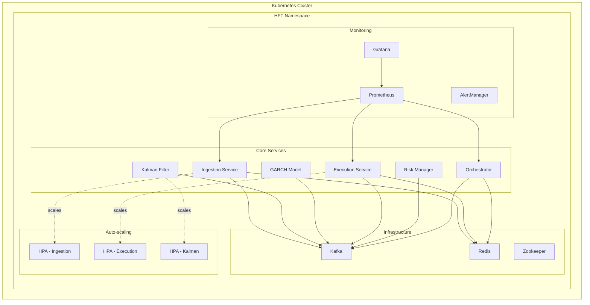

# ⚓ Kubernetes Helm Deployment Guide

## 📋 Overview

The **HFT Crypto Bot** is fully containerized and deployed using **Helm charts** on Kubernetes. This guide provides comprehensive instructions for deploying, managing, and scaling the complete application stack using industry-standard Kubernetes practices.

## 🏗️ Architecture



## 📦 Helm Chart Structure

```
infrastructure/helm/
├── hft-crypto-bot/              # Parent umbrella chart
│   ├── Chart.yaml               # Chart metadata
│   ├── values.yaml              # Default production values
│   └── templates/               # Common templates
│       ├── namespace.yaml       # Namespace creation
│       ├── _helpers.tpl         # Template helpers
│       └── NOTES.txt           # Post-install instructions
├── charts/                      # Individual service charts
│   ├── ingestion/              # Market data ingestion
│   ├── kalman-filter/          # Hedge ratio calculation
│   ├── garch-model/            # Volatility forecasting
│   ├── execution/              # Trading execution
│   ├── risk-manager/           # Risk management & BOCD
│   ├── orchestrator/           # EVOP framework
│   ├── infrastructure/         # Kafka, Redis, Zookeeper
│   └── monitoring/             # Prometheus, Grafana
└── values-staging.yaml         # Staging environment overrides
```

## 🚀 Quick Start

### **Prerequisites**
```bash
# Install Helm 3.x
curl https://raw.githubusercontent.com/helm/helm/main/scripts/get-helm-3 | bash

# Verify installation
helm version

# Ensure kubectl is configured
kubectl cluster-info
```

### **Deploy to Staging**
```bash
# Navigate to project root
cd /path/to/crypto-bot

# Deploy with staging values
./scripts/helm-deploy.sh -f infrastructure/helm/values-staging.yaml install

# Check deployment status
./scripts/helm-deploy.sh status
```

### **Deploy to Production**
```bash
# Deploy with production values
./scripts/helm-deploy.sh install

# Monitor deployment
kubectl get pods -n hft-production -w
```

## 🔧 Configuration

### **Environment Values**

#### **Production (values.yaml)**
```yaml
global:
  namespace: hft-production
  environment: production
  
services:
  ingestion:
    replicaCount: 2
    autoscaling:
      minReplicas: 2
      maxReplicas: 10
      targetCPUUtilizationPercentage: 70
      
  orchestrator:
    env:
      EVOP_MAX_CHALLENGERS: "5"
      CHAMPION_INITIAL_CAPITAL: "500000.0"
      EVOP_CONFIDENCE_LEVEL: "0.99"
```

#### **Staging (values-staging.yaml)**
```yaml
global:
  namespace: hft-staging
  environment: staging
  
services:
  ingestion:
    replicaCount: 1
    autoscaling:
      minReplicas: 1
      maxReplicas: 3
      targetCPUUtilizationPercentage: 60
      
  orchestrator:
    env:
      EVOP_MAX_CHALLENGERS: "2"
      CHAMPION_INITIAL_CAPITAL: "10000.0"
      EVOP_CONFIDENCE_LEVEL: "0.8"
```

### **Resource Management**

#### **Production Resources**
```yaml
resources:
  ingestion:
    requests: { memory: "512Mi", cpu: "500m" }
    limits: { memory: "2Gi", cpu: "2000m" }
    
  orchestrator:
    requests: { memory: "2Gi", cpu: "1500m" }
    limits: { memory: "8Gi", cpu: "6000m" }
    
  kafka:
    requests: { memory: "1Gi", cpu: "1000m" }
    limits: { memory: "4Gi", cpu: "4000m" }
```

#### **Staging Resources (Reduced)**
```yaml
resources:
  ingestion:
    requests: { memory: "256Mi", cpu: "250m" }
    limits: { memory: "1Gi", cpu: "1000m" }
    
  orchestrator:
    requests: { memory: "1Gi", cpu: "750m" }
    limits: { memory: "4Gi", cpu: "3000m" }
```

## 📈 Horizontal Pod Autoscaling (HPA)

### **HPA Configuration**

#### **Ingestion Service** (High Traffic)
```yaml
autoscaling:
  enabled: true
  minReplicas: 2
  maxReplicas: 10
  targetCPUUtilizationPercentage: 70
  targetMemoryUtilizationPercentage: 80
  behavior:
    scaleUp:
      stabilizationWindowSeconds: 60
      policies:
      - type: Percent
        value: 100    # Scale up by 100% quickly
        periodSeconds: 30
    scaleDown:
      stabilizationWindowSeconds: 300
      policies:
      - type: Percent
        value: 10     # Scale down slowly (10%)
        periodSeconds: 60
```

#### **Execution Service** (Critical)
```yaml
autoscaling:
  enabled: true
  minReplicas: 2
  maxReplicas: 6
  targetCPUUtilizationPercentage: 75
  behavior:
    scaleUp:
      stabilizationWindowSeconds: 60
      policies:
      - type: Pods
        value: 2      # Add 2 pods at a time
        periodSeconds: 60
```

#### **Risk Manager** (Stable)
```yaml
autoscaling:
  enabled: true
  minReplicas: 2
  maxReplicas: 4
  targetCPUUtilizationPercentage: 80
  # Conservative scaling for stability
```

### **HPA Monitoring**
```bash
# View current HPA status
kubectl get hpa -n hft-production

# Describe specific HPA
kubectl describe hpa ingestion-service -n hft-production

# Watch HPA scaling in real-time
kubectl get hpa -n hft-production -w
```

## 🧪 Testing & Validation

### **Helm Chart Validation**
```bash
# Lint all charts
./scripts/helm-deploy.sh lint

# Generate templates for review
./scripts/helm-deploy.sh template

# Dry run deployment
./scripts/helm-deploy.sh --dry-run install
```

### **Load Testing HPA**
```bash
# Run automated load test
./scripts/helm-deploy.sh load-test

# Monitor scaling during test
kubectl get pods -n hft-production -l app=ingestion-service -w
```

### **Manual Load Test**
```bash
# Create load test pod
kubectl run load-test --image=curlimages/curl -n hft-production -it --rm -- /bin/sh

# Inside the pod, generate load
for i in {1..1000}; do
  curl -s http://ingestion-service:8000/health &
  curl -s http://ingestion-service:8000/metrics &
done
```

## 🔄 Deployment Operations

### **Installation**
```bash
# Fresh installation
helm install hft-crypto-bot infrastructure/helm/hft-crypto-bot \
  --namespace hft-production \
  --create-namespace \
  --wait --timeout 600s

# With custom values
helm install hft-crypto-bot infrastructure/helm/hft-crypto-bot \
  --namespace hft-staging \
  --values infrastructure/helm/values-staging.yaml \
  --create-namespace
```

### **Upgrades**
```bash
# Upgrade existing deployment
helm upgrade hft-crypto-bot infrastructure/helm/hft-crypto-bot \
  --namespace hft-production \
  --wait --timeout 600s

# Upgrade with new values
helm upgrade hft-crypto-bot infrastructure/helm/hft-crypto-bot \
  --namespace hft-production \
  --values new-values.yaml
```

### **Rollbacks**
```bash
# View deployment history
helm history hft-crypto-bot -n hft-production

# Rollback to previous version
helm rollback hft-crypto-bot -n hft-production

# Rollback to specific version
helm rollback hft-crypto-bot 3 -n hft-production
```

### **Uninstallation**
```bash
# Uninstall release
helm uninstall hft-crypto-bot -n hft-production

# Delete namespace (optional)
kubectl delete namespace hft-production
```

## 📊 Monitoring & Observability

### **Service Health Checks**
```bash
# Check all pods
kubectl get pods -n hft-production

# Check service endpoints
kubectl get endpoints -n hft-production

# Check HPA status
kubectl get hpa -n hft-production

# Check resource usage
kubectl top pods -n hft-production
```

### **Log Aggregation**
```bash
# View logs for specific service
kubectl logs -f deployment/ingestion-service -n hft-production

# View logs from all ingestion pods
kubectl logs -f -l app=ingestion-service -n hft-production

# Stream logs from orchestrator
kubectl logs -f deployment/orchestrator-service -n hft-production
```

### **Metrics Access**
```bash
# Port-forward to Grafana
kubectl port-forward service/grafana 3000:3000 -n hft-production

# Port-forward to Prometheus
kubectl port-forward service/prometheus 9090:9090 -n hft-production

# Access orchestrator API
kubectl port-forward service/orchestrator-service 8005:8005 -n hft-production
curl http://localhost:8005/status
```

## ⚡ Performance Tuning

### **Resource Optimization**

#### **CPU-Intensive Services**
```yaml
# GARCH Model and Kalman Filter
resources:
  requests:
    cpu: "1000m"      # Guaranteed CPU
    memory: "1Gi"
  limits:
    cpu: "4000m"      # Burst capacity
    memory: "4Gi"

nodeSelector:
  node-type: "cpu-optimized"
```

#### **Memory-Intensive Services**
```yaml
# Orchestrator with EVOP Framework
resources:
  requests:
    cpu: "1500m"
    memory: "2Gi"     # Guaranteed memory
  limits:
    cpu: "6000m"
    memory: "8Gi"     # Large memory limit

nodeSelector:
  node-type: "memory-optimized"
```

### **Storage Optimization**
```yaml
# Production with persistent storage
persistence:
  enabled: true
  storageClass: "ssd"
  size: 100Gi
  accessMode: ReadWriteOnce

# Staging with emptyDir (faster, ephemeral)
persistence:
  enabled: false
```

### **Network Optimization**
```yaml
# Service mesh integration
istio:
  enabled: true
  virtualService:
    enabled: true
    timeout: 30s
  destinationRule:
    enabled: true
    trafficPolicy:
      connectionPool:
        tcp:
          maxConnections: 100
        http:
          http1MaxPendingRequests: 100
          maxRequestsPerConnection: 10
```

## 🔒 Security & Best Practices

### **Security Contexts**
```yaml
securityContext:
  runAsNonRoot: true
  runAsUser: 1001
  fsGroup: 1001
  allowPrivilegeEscalation: false
  readOnlyRootFilesystem: false
```

### **Network Policies**
```yaml
networkPolicy:
  enabled: true
  ingress:
    - from:
      - namespaceSelector:
          matchLabels:
            name: hft-production
      ports:
      - protocol: TCP
        port: 8000
```

### **Pod Disruption Budgets**
```yaml
podDisruptionBudget:
  enabled: true
  minAvailable: 1    # Always keep 1 pod running
  # OR
  maxUnavailable: 50%  # Allow up to 50% unavailability
```

### **Resource Quotas**
```yaml
apiVersion: v1
kind: ResourceQuota
metadata:
  name: hft-production-quota
spec:
  hard:
    requests.cpu: "20"      # Total CPU requests
    requests.memory: 40Gi   # Total memory requests
    limits.cpu: "80"        # Total CPU limits
    limits.memory: 160Gi    # Total memory limits
    pods: "50"              # Maximum pods
    persistentvolumeclaims: "10"
```

## 🛠️ Troubleshooting

### **Common Issues**

#### **Pod Startup Issues**
```bash
# Check pod status
kubectl get pods -n hft-production

# Describe problematic pod
kubectl describe pod <pod-name> -n hft-production

# Check logs
kubectl logs <pod-name> -n hft-production --previous

# Check resource constraints
kubectl top pods -n hft-production
```

#### **HPA Not Scaling**
```bash
# Check metrics server
kubectl get apiservice v1beta1.metrics.k8s.io

# Check HPA status
kubectl describe hpa ingestion-service -n hft-production

# Check resource usage
kubectl top pods -n hft-production -l app=ingestion-service

# Manual scaling test
kubectl scale deployment ingestion-service --replicas=5 -n hft-production
```

#### **Service Discovery Issues**
```bash
# Check services
kubectl get services -n hft-production

# Check endpoints
kubectl get endpoints -n hft-production

# Test connectivity
kubectl run debug --image=curlimages/curl -n hft-production -it --rm -- /bin/sh
# Inside: curl http://ingestion-service:8000/health
```

#### **Storage Issues**
```bash
# Check PVCs
kubectl get pvc -n hft-production

# Check storage class
kubectl get storageclass

# Check volume mounts
kubectl describe pod <pod-name> -n hft-production
```

### **Debug Commands**
```bash
# Interactive debugging
kubectl exec -it deployment/orchestrator-service -n hft-production -- /bin/sh

# Port forwarding for local debugging
kubectl port-forward deployment/orchestrator-service 8005:8005 -n hft-production

# Copy files from pod
kubectl cp hft-production/<pod-name>:/app/logs ./local-logs

# Run one-off debug pod
kubectl run debug --image=python:3.11-slim -n hft-production -it --rm -- /bin/bash
```

## 📈 Scaling Strategies

### **Vertical Scaling**
```bash
# Increase resource limits
helm upgrade hft-crypto-bot infrastructure/helm/hft-crypto-bot \
  --set services.orchestrator.resources.limits.memory=16Gi \
  --set services.orchestrator.resources.limits.cpu=8000m
```

### **Horizontal Scaling**
```bash
# Adjust HPA parameters
helm upgrade hft-crypto-bot infrastructure/helm/hft-crypto-bot \
  --set services.ingestion.autoscaling.maxReplicas=20 \
  --set services.ingestion.autoscaling.targetCPUUtilizationPercentage=60
```

### **Cluster Scaling**
```bash
# Add nodes (cloud provider specific)
# GKE
gcloud container clusters resize my-cluster --num-nodes 10

# EKS
eksctl scale nodegroup --cluster my-cluster --name my-nodegroup --nodes 10

# AKS
az aks scale --resource-group myResourceGroup --name myCluster --node-count 10
```

## 🔄 CI/CD Integration

### **GitOps Workflow**
```yaml
# .github/workflows/helm-deploy.yml
name: Helm Deploy
on:
  push:
    branches: [main]

jobs:
  deploy:
    runs-on: ubuntu-latest
    steps:
    - uses: actions/checkout@v4
    
    - name: Setup Helm
      uses: azure/setup-helm@v3
      
    - name: Deploy to staging
      run: |
        helm upgrade --install hft-crypto-bot-staging \
          infrastructure/helm/hft-crypto-bot \
          --values infrastructure/helm/values-staging.yaml \
          --namespace hft-staging \
          --create-namespace
```

### **ArgoCD Integration**
```yaml
# argocd-application.yaml
apiVersion: argoproj.io/v1alpha1
kind: Application
metadata:
  name: hft-crypto-bot
  namespace: argocd
spec:
  project: default
  source:
    repoURL: https://github.com/yourusername/crypto-bot
    targetRevision: HEAD
    path: infrastructure/helm/hft-crypto-bot
    helm:
      valueFiles:
      - values.yaml
  destination:
    server: https://kubernetes.default.svc
    namespace: hft-production
  syncPolicy:
    automated:
      prune: true
      selfHeal: true
```

## 📚 Advanced Topics

### **Multi-Cluster Deployment**
```bash
# Production cluster
kubectl config use-context production-cluster
helm install hft-crypto-bot infrastructure/helm/hft-crypto-bot \
  --namespace hft-production

# Disaster recovery cluster
kubectl config use-context dr-cluster
helm install hft-crypto-bot-dr infrastructure/helm/hft-crypto-bot \
  --namespace hft-production \
  --set global.environment=disaster-recovery
```

### **Blue-Green Deployment**
```bash
# Deploy green environment
helm install hft-crypto-bot-green infrastructure/helm/hft-crypto-bot \
  --namespace hft-green \
  --create-namespace

# Switch traffic (update ingress/load balancer)
# Cleanup blue environment after validation
helm uninstall hft-crypto-bot-blue -n hft-blue
```

### **Canary Deployment**
```bash
# Deploy canary with reduced traffic
helm install hft-crypto-bot-canary infrastructure/helm/hft-crypto-bot \
  --namespace hft-canary \
  --set services.ingestion.replicaCount=1 \
  --set global.canary=true
```

## 🆘 Support & Maintenance

### **Health Monitoring**
```bash
# Automated health check script
#!/bin/bash
kubectl get pods -n hft-production | grep -v Running | grep -v Completed
if [ $? -eq 0 ]; then
  echo "Unhealthy pods detected!"
  # Send alert
fi
```

### **Backup Procedures**
```bash
# Backup Helm values
helm get values hft-crypto-bot -n hft-production > backup-values.yaml

# Backup persistent data
kubectl create job backup-$(date +%Y%m%d) \
  --from=cronjob/data-backup -n hft-production
```

### **Disaster Recovery**
```bash
# Export all resources
kubectl get all -n hft-production -o yaml > backup-resources.yaml

# Restore from backup
kubectl apply -f backup-resources.yaml
```

---

## 📝 Quick Reference

### **Essential Commands**
```bash
# Deploy
./scripts/helm-deploy.sh install

# Check status  
kubectl get pods -n hft-production

# Scale service
kubectl scale deployment ingestion-service --replicas=5 -n hft-production

# View logs
kubectl logs -f deployment/orchestrator-service -n hft-production

# Port forward
kubectl port-forward service/grafana 3000:3000 -n hft-production

# Load test
./scripts/helm-deploy.sh load-test
```

### **Helpful Aliases**
```bash
alias k='kubectl'
alias kgp='kubectl get pods'
alias kgs='kubectl get services'
alias kgh='kubectl get hpa'
alias klf='kubectl logs -f'
alias kpf='kubectl port-forward'
```

The **Kubernetes Helm deployment** provides a **production-ready, scalable, and maintainable** way to deploy the HFT Crypto Bot with full **auto-scaling capabilities** and **comprehensive monitoring**! ⚓📈✨
