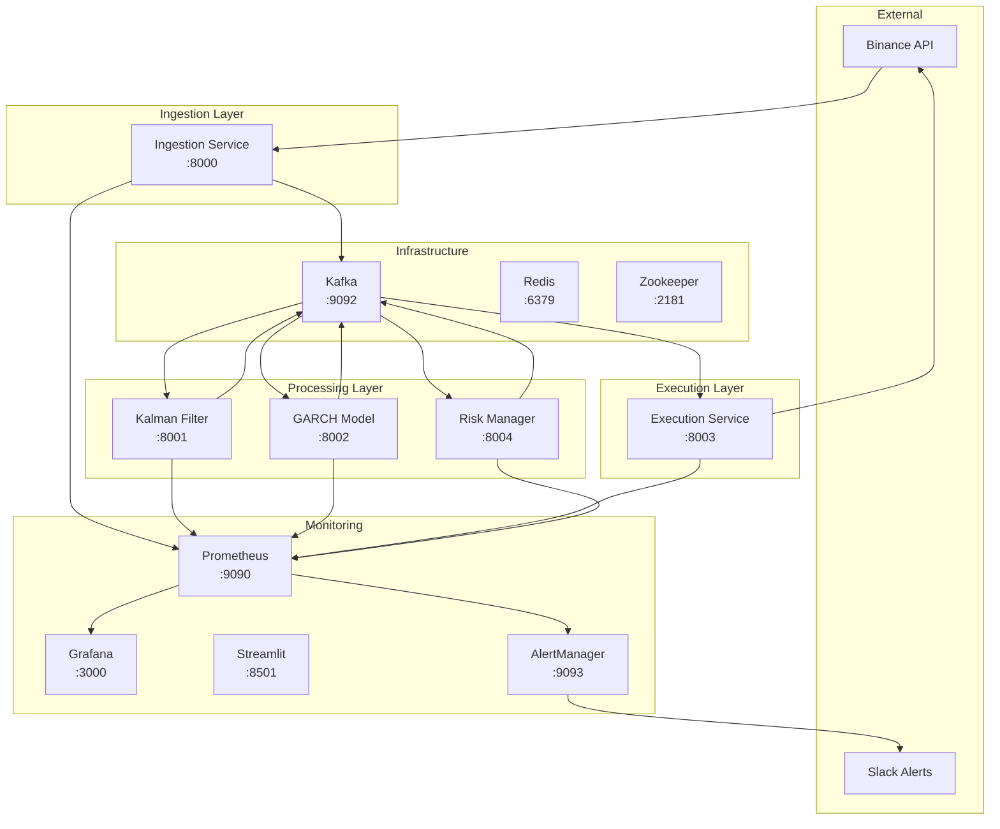

# 🐳 HFT Crypto Bot - Docker Containerized Deployment

[](https://www.docker.com/)
[](https://docs.docker.com/compose/)
[](https://github.com/your-repo/crypto-bot)

A fully containerized, production-ready high-frequency trading system for cryptocurrency pairs trading.

## 🏗️ Architecture Overview



## 🚀 Quick Start

### Prerequisites
- Docker Desktop 4.0+ with 8GB+ memory allocated
- Docker Compose v2.0+
- 20GB+ free disk space

### 1-Minute Setup
```bash
# Clone and setup
git clone <your-repo-url>
cd crypto-bot

# Configure environment
cp env.dev.example .env.dev
# Edit .env.dev with your Binance testnet API keys

# Start development environment
./scripts/deploy.sh -e development up

# Check health
./scripts/health-check.sh
```

### Access Dashboards
- **Trading Dashboard**: http://localhost:3000 (admin/admin123)
- **Metrics**: http://localhost:9090
- **Analysis**: http://localhost:8501
- **Kafka UI**: http://localhost:8090

## 📦 Container Services

### Core HFT Services

#### 🔄 Ingestion Service (`crypto-bot-ingestion`)
- **Purpose**: Real-time market data ingestion from Binance WebSocket
- **Port**: 8000 (metrics)
- **Health**: `curl http://localhost:8000/health`
- **Resources**: 512MB RAM, 0.5 CPU

#### 📊 Kalman Filter Service (`crypto-bot-kalman-filter`)
- **Purpose**: Dynamic hedge ratio calculation using Kalman filtering
- **Port**: 8001 (metrics)
- **Health**: `curl http://localhost:8001/health`
- **Resources**: 1GB RAM, 1.0 CPU

#### 📈 GARCH Model Service (`crypto-bot-garch-volatility`)
- **Purpose**: Volatility forecasting and dynamic threshold calculation
- **Port**: 8002 (metrics)
- **Health**: `curl http://localhost:8002/health`
- **Resources**: 1GB RAM, 1.5 CPU

#### ⚡ Execution Service (`crypto-bot-execution`)
- **Purpose**: Trading strategy orchestration and order execution
- **Port**: 8003 (metrics)
- **Health**: `curl http://localhost:8003/health`
- **Resources**: 1GB RAM, 2.0 CPU
- **Database**: SQLite persistent storage

#### 🛡️ Risk Manager Service (`crypto-bot-risk-manager`)
- **Purpose**: Bayesian Online Changepoint Detection and circuit breaker
- **Port**: 8004 (metrics)
- **Health**: `curl http://localhost:8004/health`
- **Resources**: 1GB RAM, 1.5 CPU

### Infrastructure Services

#### 📡 Kafka Cluster
- **Broker**: `crypto-bot-kafka:9092`
- **Zookeeper**: `crypto-bot-zookeeper:2181`
- **UI**: http://localhost:8090
- **Optimized**: HFT-specific configuration for low latency

#### 💾 Redis Cache
- **Purpose**: Service registry and caching
- **Port**: 6379
- **Config**: LRU eviction, AOF persistence

### Monitoring Stack

#### 📊 Prometheus + Grafana
- **Prometheus**: http://localhost:9090
- **Grafana**: http://localhost:3000
- **Retention**: 30 days (production), 24 hours (development)
- **Dashboards**: Pre-configured HFT trading dashboard

#### 🚨 AlertManager
- **Port**: 9093
- **Integrations**: Slack, Email, PagerDuty
- **Rules**: 20+ predefined trading and system alerts

#### 📈 Streamlit Analytics
- **Port**: 8501
- **Features**: Real-time P&L analysis, custom queries
- **Data Source**: Direct Prometheus integration

## 🛠️ Deployment Commands

### Using Deployment Scripts
```bash
# Build all services
./scripts/docker-build.sh

# Development deployment
./scripts/deploy.sh -e development up

# Production deployment  
./scripts/deploy.sh -e production up

# Health check
./scripts/health-check.sh -v

# View logs
./scripts/deploy.sh logs execution-service

# Scale services
./scripts/deploy.sh -e production up --scale kalman-filter-service=3
```

### Manual Docker Compose
```bash
# Development
docker-compose -f docker-compose.yml -f docker-compose.dev.yml up -d

# Production
docker-compose -f docker-compose.yml -f docker-compose.prod.yml up -d

# Specific services
docker-compose up -d kafka redis prometheus grafana

# Build and start
docker-compose up -d --build
```

## ⚙️ Configuration

### Environment Files

#### Development (`.env.dev`)
```bash
BINANCE_TESTNET=true
LOG_LEVEL=DEBUG
SYMBOLS=BTCUSDT,ETHUSDT
MAX_POSITION_SIZE=1000
ENABLE_PAPER_TRADING=true
```

#### Production (`.env.prod`)
```bash
BINANCE_TESTNET=false  # ⚠️ LIVE TRADING
LOG_LEVEL=INFO
SYMBOLS=BTCUSDT,ETHUSDT,ADAUSDT,BNBUSDT,SOLUSDT
MAX_POSITION_SIZE=50000
ENABLE_PAPER_TRADING=false
```

### Resource Allocation

#### Development Profile
- **Total Memory**: ~4GB
- **CPU Usage**: ~3 cores
- **Disk Space**: ~5GB

#### Production Profile
- **Total Memory**: ~12GB
- **CPU Usage**: ~8 cores
- **Disk Space**: ~50GB (with data retention)

## 📊 Monitoring & Observability

### Key Metrics
- **Trading**: P&L, positions, order fill rates, slippage
- **System**: Latency, throughput, error rates, resource usage
- **Risk**: Drawdown, position sizes, circuit breaker status
- **Market**: Spread, volatility, hedge ratios

### Alerting Rules
- High latency (>100ms end-to-end)
- Trading halt triggered
- Service health failures
- High error rates (>5%)
- Resource exhaustion
- Significant drawdown (>10%)

### Log Aggregation
```bash
# Structured JSON logs
docker-compose logs -f --tail=100 execution-service

# All services
docker-compose logs -f

# Filter by log level
docker-compose logs -f | grep "ERROR"
```

## 🔧 Troubleshooting

### Common Issues

#### Services Won't Start
```bash
# Check Docker resources
docker system df
docker stats

# Verify configuration
docker-compose config

# Check dependencies
docker-compose ps
```

#### Network Connectivity
```bash
# Test inter-service communication
docker-compose exec execution-service ping kafka
docker-compose exec execution-service curl http://prometheus:9090/-/healthy

# Check network
docker network inspect crypto-bot_crypto-bot-network
```

#### Performance Issues
```bash
# Monitor resource usage
docker stats --no-stream

# Check service health
./scripts/health-check.sh -v

# Analyze logs
docker-compose logs -f execution-service | grep "SLOW"
```

### Debug Mode
```bash
# Enable debug logging
export LOG_LEVEL=DEBUG

# Access container shell
docker-compose exec execution-service /bin/bash

# Run diagnostics
docker-compose exec execution-service python -m services.execution.diagnostics
```

## 🚀 Production Deployment

### Security Checklist
- [ ] Change default passwords
- [ ] Configure SSL/TLS certificates
- [ ] Set up firewall rules
- [ ] Enable audit logging
- [ ] Configure secrets management
- [ ] Regular security updates

### Performance Tuning
- [ ] Optimize JVM settings for Kafka
- [ ] Tune kernel parameters for low latency
- [ ] Configure CPU affinity
- [ ] Set up dedicated network interfaces
- [ ] Optimize disk I/O

### Backup & Recovery
```bash
# Backup trading database
docker-compose exec execution-service sqlite3 /app/data/trading.db ".backup /app/data/backup.db"

# Backup Grafana dashboards
docker cp crypto-bot-grafana:/var/lib/grafana ./grafana-backup

# Backup Prometheus data
docker cp crypto-bot-prometheus:/prometheus ./prometheus-backup
```

## 📈 Scaling

### Horizontal Scaling
```bash
# Scale processing services
docker-compose up -d --scale kalman-filter-service=3 --scale garch-volatility-service=2

# Load balancer required for multiple execution services
```

### Vertical Scaling
```yaml
# Increase resources in docker-compose.prod.yml
deploy:
  resources:
    limits:
      memory: 4G
      cpus: '2.0'
```

## 🔄 CI/CD Integration

### GitHub Actions
```yaml
name: Deploy HFT Bot
on:
  push:
    branches: [main]
jobs:
  deploy:
    runs-on: ubuntu-latest
    steps:
      - uses: actions/checkout@v3
      - name: Deploy
        run: |
          ./scripts/docker-build.sh --registry ${{ secrets.REGISTRY }}
          ./scripts/deploy.sh -e production up
```

### Docker Registry
```bash
# Tag for registry
docker tag crypto-bot-execution:latest registry.com/hft/execution:v1.0.0

# Push to registry
docker push registry.com/hft/execution:v1.0.0
```

## 📚 Additional Resources

- [Docker Deployment Guide](./DOCKER_DEPLOYMENT_GUIDE.md)
- [Monitoring Setup](./MONITORING_SETUP.md)
- [API Documentation](./docs/api.md)
- [Performance Tuning](./docs/performance.md)

## 🆘 Support

### Health Check
```bash
./scripts/health-check.sh -v
```

### Get Help
1. Check service logs: `docker-compose logs -f [service]`
2. Verify health: `./scripts/health-check.sh`
3. Check resources: `docker stats`
4. Review configuration: `docker-compose config`

---

**⚠️ Production Warning**: This system can execute live trades. Always test thoroughly in the testnet environment before deploying to production.
